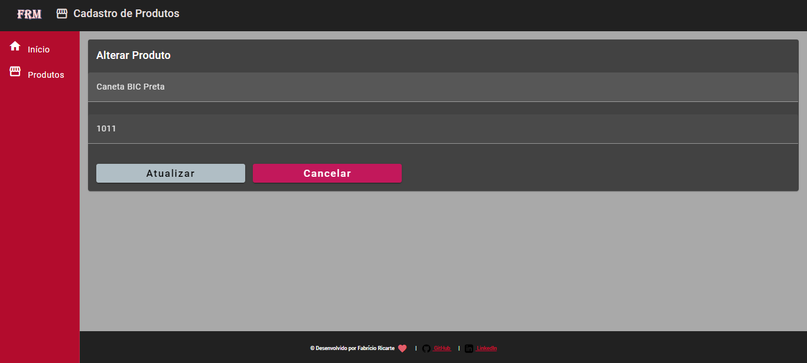

# Curso Angular Crud
 
<h2><strong>O que Foi estudado:</strong></h2>

   
   
   
   
   

 

   

      Este repositório foi criado para armazenar as atividades desenvolvidas no curso Anglular-9 Essencial da Cod3r.
   

     
    
   

      Neste curso foi desenvolvido uma página para <strong>listagem dos produtos</strong>.
   

    
   

      Uma página para <strong>edição dos produtos</strong>.
   

    
   

      <strong>Exclusão dos produtos</strong>.
   

    
   

     <strong>Inserção de novos produtos</strong>.
   

    

 
